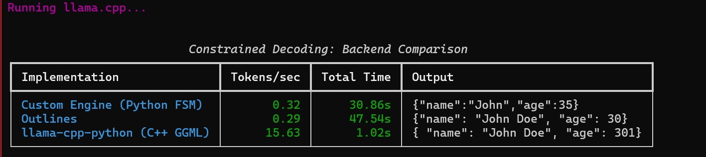
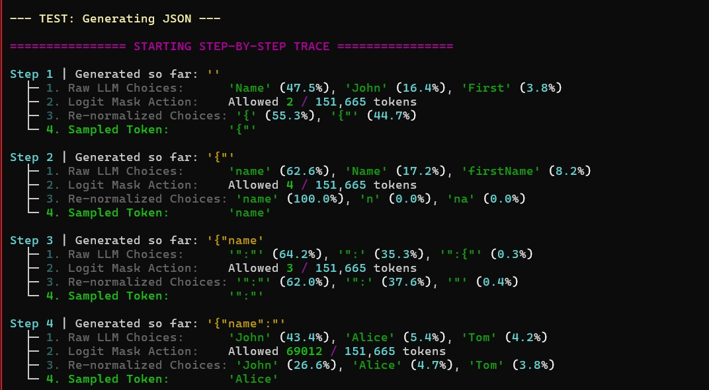

# Logit-Level Constrained Decoding Engine

A custom, PyTorch-based LLM inference engine built from scratch that forces language models to generate strictly valid outputs (JSON, Python, XML) using Context-Free Grammars (CFG) and Finite State Machines (FSM). 

Instead of relying on prompt engineering or post-generation parsing, this engine intercepts the raw logits at every decoding step, calculates mathematically valid next-token pathways, and dynamically masks out structural hallucinations before they can be sampled.

## Performance & Benchmarks

To validate the architecture, this engine was benchmarked head-to-head against production industry standards using the **Qwen2.5-0.5B-Instruct** model on a strict JSON schema generation task.



| Implementation | Backend | Output Validity | Architecture Notes |
| :--- | :--- | :--- | :--- |
| **llama-cpp-python** | C++ GGML | 100% Valid | Heavily optimized C++ backend with GBNF grammars. Unbeatable latency. |
| **Outlines (v1.x)** | PyTorch + AOT | 100% Valid | Uses Ahead-Of-Time (AOT) token index compilation for faster masking. |
| **Custom Engine** | Python FSM | 100% Valid | Dynamic, character-by-character FSM compilation in the Python loop. |

*Note: While slower than AOT and C++ implementations due to Python interpreter overhead, the custom engine successfully maintained a 100% structural validity rate, proving the underlying compiler-theory mechanics are mathematically sound.*

## Core Capabilities

This engine bridges compiler theory and deep learning by integrating `Lark` (for CFG parsing) and `interegular` (for regex-to-FSM compilation) directly into the PyTorch sampling loop.

*   **Character-Level Regex Enforcement:** Masks logits perfectly to enforce length and character limits (e.g., forcing a maximum 3-digit integer for a JSON age field).
*   **Recursive CFG Loops:** Navigates infinite argument generation in Python function signatures without breaking syntax or generating invalid tokens.
*   **Cross-Boundary Token Parsing:** Successfully parses multi-character tokens across different grammar rule boundaries while overriding the LLM's pre-trained formatting biases (e.g., forcing raw XML attributes without standard quotes).

## How It Works (The Math)

At each step `t` in the generation process:
1. The LLM outputs a raw logit vector for the next token.
2. The FSM evaluates the current context against the active Context-Free Grammar.
3. A binary mask `M` is generated, where valid tokens equal `0` and invalid tokens equal `-inf`.
4. The mask is applied to the raw logits before softmax: 
   `constrained_logits = (raw_logits / temperature) + M`
5. The model is forced to sample only from the mathematically valid subset.


*Above: A step-by-step trace showing the engine blocking illegal tokens (like premature commas or markdown backticks) and redistributing probabilities.*

## Repository Architecture

```text
Constrained-Decoding-Engine
 ┣ assets/          # Benchmark and trace screenshots
 ┣ benchmarks/      # Head-to-head latency tests vs Outlines & llama.cpp
 ┣ examples/        # Ready-to-run demo scripts (JSON, XML, Python)
 ┣ src/             
 ┃ ┣ grammars/      # Grammar rule definitions
 ┃ ┣ cfg_engine.py  # FSM and Lark CFG wrappers
 ┃ ┣ model_runner.py# Hugging Face tokenization and inference logic
 ┃ ┗ trace.py       # Probability distribution visualization logic
 ┣ main.py          # Primary entry point
 ┗ README.md
```

## Quick Start

**1. Clone the repository:**
```bash
git clone https://github.com/Aaditya-2006/Constrained-Decoding-Engine.git
cd Constrained-Decoding-Engine
```

**2. Install dependencies:**
```bash
pip install torch transformers lark interegular outlines llama-cpp-python rich pydantic
```

**3. Run the interactive examples:**
```bash
python examples/demo_python.py
```

**4. Run the benchmark suite:**
*(Requires the Qwen GGUF model to be downloaded locally for the llama.cpp test).*
```bash
python benchmarks/compare_backends.py
```
